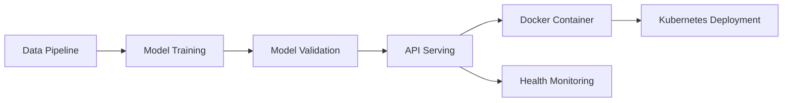

# 🏥 Diabetes Prediction MLOps Pipeline

[](https://python.org)
[](https://fastapi.tiangolo.com)
[](https://docker.com)
[](https://kubernetes.io)

> A production-ready MLOps pipeline showcasing DevOps best practices for machine learning deployment, featuring automated training, API serving, and containerized deployment.

## 🎯 Project Overview

This project demonstrates **MLOps fundamentals** with a focus on **DevOps engineering principles**:

- **Machine Learning**: Model training and validation with scikit-learn
- **API Development**: RESTful API with FastAPI and automatic documentation
- **Containerization**: Docker best practices for ML applications
- **Orchestration**: Kubernetes deployment configuration
- **Monitoring**: Health checks, logging, and observability

**Perfect for**: Cloud engineers transitioning to MLOps, showcasing automation and deployment skills.

## 🏗️ Architecture



## 🛠️ Tech Stack

| Component | Technology | Purpose |
|-----------|------------|---------|
| **ML Framework** | scikit-learn | Model training and inference |
| **API Framework** | FastAPI | REST API with automatic docs |
| **Containerization** | Docker | Application packaging |
| **Orchestration** | Kubernetes | Container orchestration |
| **Model Serving** | Uvicorn | ASGI production server |
| **Data Processing** | pandas, numpy | Data manipulation |

## ⚡ Quick Start

### Prerequisites
- Python 3.10+
- Docker (optional)
- Kubernetes cluster (optional)

### 1. Clone & Setup
```bash
git clone https://github.com/JhamelThorne/diabetes-prediction-mlops.git
cd diabetes-prediction-mlops

# Create virtual environment
python -m venv .mlops
source .mlops/bin/activate  # Linux/Mac
# .\.mlops\Scripts\Activate.ps1  # Windows

# Install dependencies
pip install -r requirements.txt
```

### 2. Train the Model
```bash
python train.py
```
**Output**: Creates `diabetes_model.pkl` and `model_metadata.json`

### 3. Start the API
```bash
python main.py
# or
uvicorn main:app --host 0.0.0.0 --port 8000 --reload
```

### 4. Access the API
- **API Home**: http://localhost:8000
- **Interactive Docs**: http://localhost:8000/docs
- **Health Check**: http://localhost:8000/health

## 🐳 Docker Deployment

```bash
# Build image
docker build -t diabetes-mlops-api .

# Run container
docker run -p 8000:8000 diabetes-mlops-api

# Verify deployment
curl http://localhost:8000/health
```

## ☸️ Kubernetes Deployment

```bash
# Deploy to cluster
kubectl apply -f k8s-deploy.yml

# Check status
kubectl get pods
kubectl get services

# Port forward for local access
kubectl port-forward service/diabetes-api 8000:80
```

## 🔧 API Usage

### Health Check
```bash
curl http://localhost:8000/health
```

### Make Prediction
```bash
curl -X POST http://localhost:8000/predict \
  -H "Content-Type: application/json" \
  -d '{
    "Pregnancies": 2,
    "Glucose": 120.0,
    "BloodPressure": 70.0,
    "BMI": 25.5,
    "Age": 30
  }'
```

**Response:**
```json
{
  "diabetic": false,
  "probability": 0.234,
  "model_version": "1.0",
  "timestamp": "2025-08-08T21:30:00"
}
```

## 📁 Project Structure

```
diabetes-prediction-mlops/
├── 🤖 train.py              # ML training pipeline
├── 🚀 main.py               # FastAPI application
├── 📋 requirements.txt      # Dependencies
├── 🐳 Dockerfile            # Container config
├── ☸️ k8s-deploy.yml        # Kubernetes deployment
├── 📊 model_metadata.json   # Model info (generated)
├── 🎯 diabetes_model.pkl    # Trained model (generated)
└── 📚 README.md             # Documentation
```

## 🧪 Testing

### Interactive Testing
Visit http://localhost:8000/docs for the Swagger UI interface.

### Sample Test Cases

| Scenario | Pregnancies | Glucose | BloodPressure | BMI | Age | Expected |
|----------|-------------|---------|---------------|-----|-----|----------|
| Low Risk | 1 | 85 | 65 | 22.0 | 25 | `false` |
| Medium Risk | 3 | 120 | 75 | 28.5 | 35 | `false` |
| High Risk | 6 | 180 | 90 | 35.0 | 45 | `true` |

## 📈 Features

### DevOps Best Practices
- ✅ **Automated Training**: Reproducible ML pipeline
- ✅ **API Documentation**: Auto-generated OpenAPI specs
- ✅ **Health Monitoring**: Built-in health checks and metrics
- ✅ **Containerization**: Production-ready Docker setup
- ✅ **Configuration**: Environment-based config management
- ✅ **Logging**: Structured logging for observability

### Production Ready
- ✅ **Error Handling**: Comprehensive API error responses
- ✅ **Input Validation**: Pydantic schema validation
- ✅ **Model Versioning**: Metadata tracking and versioning
- ✅ **Scalability**: Kubernetes horizontal pod autoscaling ready
- ✅ **Security**: Input sanitization and validation

## 🚀 Next Steps

### CI/CD Integration
- GitHub Actions for automated testing
- Model validation pipelines
- Automated deployment to cloud platforms

### Advanced Features
- Model drift detection
- A/B testing framework
- Database integration for prediction logging
- Authentication and rate limiting

## 📚 Technologies Demonstrated

**DevOps & Cloud Skills:**
- Container orchestration (Docker, Kubernetes)
- API development and documentation (FastAPI, OpenAPI)
- Infrastructure automation principles
- Monitoring and observability setup
- Production deployment patterns

**Data & ML Skills:**
- ML pipeline development and automation
- Model training, validation, and serving
- Data processing and feature engineering
- Model performance monitoring

## 🤝 Contributing

1. Fork the repository
2. Create a feature branch (`git checkout -b feature/improvement`)
3. Commit changes (`git commit -am 'Add new feature'`)
4. Push to branch (`git push origin feature/improvement`)
5. Create a Pull Request

## 📝 License

This project is licensed under the MIT License - see the [LICENSE](LICENSE) file for details.

## 👨‍💻 About

**Built by**: Jha'Mel Thorne  
**Focus**: Data analyst transitioning to Cloud Engineering & DevOps
**LinkedIn**: [linkedin.com/in/jhamel-thorne](https://www.linkedin.com/in/jhamel-thorne/)

This project showcases the intersection of **DevOps engineering** and **machine learning operations**, demonstrating how to build production-ready ML systems with proper automation, monitoring, and deployment practices.

---

⭐ **Star this repository if you found it helpful for your MLOps journey!**  
🐛 **Found an issue?** [Open an issue](https://github.com/JhamelThorne/diabetes-prediction-mlops/issues) and let's fix it together.

